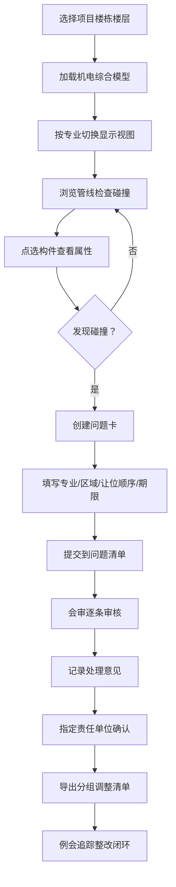

## 1. 产品概述

机电管综排布 Web 协同应用，面向总包 BIM 负责人和各专业分包技术员在深化设计阶段共同梳理管线位置。通过数字化方式记录碰撞问题、会审意见和整改追踪，实现管综问题的闭环管理，提升协同效率。

## 2. 核心功能

### 2.1 用户角色

| 角色 | 登录方式 | 核心权限 |
|------|----------|----------|
| 总包 BIM 负责人 | 账号登录 | 模型管理、问题审核、会审记录、导出清单、全流程管控 |
| 专业分包技术员 | 账号登录 | 查看模型、上报问题、确认整改、查看处理意见 |

### 2.2 功能模块

1. **模型导入与楼层定位**：项目/楼栋/楼层层级管理，机电模型上传选择，按专业分色显示标高
2. **碰撞问题清单**：点选构件生成问题卡，按专业/楼层/状态筛选，问题详情查看
3. **调整会审记录**：逐条会审勾选，记录处理意见，责任单位确认，导出调整清单

### 2.3 页面详情

| 页面名称 | 模块名称 | 功能描述 |
|-----------|-------------|---------------------|
| 模型导入与楼层定位 | 项目树导航 | 三级层级：项目→楼栋→楼层，支持展开收起和快速切换 |
| 模型导入与楼层定位 | 模型上传选择 | 支持上传模型文件或从已有模型库选择，记录上传人和时间 |
| 模型导入与楼层定位 | 专业视图切换 | 风管(蓝)/水管(绿)/桥架(橙)/消防管(红)分色显示，可单独或组合显示 |
| 模型导入与楼层定位 | 标高显示 | 显示各专业管线底标高、顶标高、管径信息 |
| 模型导入与楼层定位 | 构件点选 | 点击模型构件高亮显示，查看属性，快速生成问题 |
| 碰撞问题清单 | 问题列表 | 卡片式展示所有问题，显示专业、位置、状态、期限 |
| 碰撞问题清单 | 筛选搜索 | 按专业、楼层、状态、责任单位多维度筛选，关键词搜索 |
| 碰撞问题清单 | 问题卡详情 | 所属专业、影响区域、构件信息、建议让位顺序、整改期限 |
| 碰撞问题清单 | 新建问题 | 点选构件后快速创建，填写问题信息，上传现场照片 |
| 调整会审记录 | 会审勾选 | 逐条勾选待会审问题，批量或单条处理 |
| 调整会审记录 | 处理意见 | 记录"上翻""下绕""改走廊侧边"等标准化处理意见，支持自定义 |
| 调整会审记录 | 责任确认 | 指定责任单位，设置确认期限，记录确认状态 |
| 调整会审记录 | 导出清单 | 按楼层和专业分组导出 Excel/PDF 格式管综调整清单 |

## 3. 核心流程

用户登录后进入项目列表，选择具体项目和楼层加载模型；在模型视图中浏览各专业管线，发现交叉碰撞后点选构件创建问题卡，填写详细信息；会审时负责人逐条审核问题，记录处理方案并指定责任单位；分包单位确认后进行整改；最后导出分组清单用于例会追踪。

## 4. 用户界面设计

### 4.1 设计风格

**工业专业风**：体现工程领域的严谨性和专业性
- 主色：深蓝 `#1e3a5f`（专业、可靠、稳重）
- 辅色：工程橙 `#e87722`（警示、重点、问题标识）
- 专业色：风管蓝 `#4a90d9`、水管绿 `#2ecc71`、桥架橙 `#f39c12`、消防红 `#e74c3c`
- 中性色：深灰 `#2c3e50`、中灰 `#7f8c8d`、浅灰 `#ecf0f1`
- 按钮风格：直角矩形，2px 边框，悬停时轻微阴影
- 字体："Noto Sans SC" 无衬线字体，标题 18-24px，正文 14px，标注 12px
- 布局：左侧导航 + 右侧内容区，顶部工具栏，卡片式信息展示
- 图标：使用线性工程类图标，清晰易懂

### 4.2 页面设计概述

| 页面名称 | 模块名称 | UI 元素 |
|-----------|-------------|-------------|
| 模型导入与楼层定位 | 项目树 | 缩进树形结构，选中高亮，展开动画 |
| 模型导入与楼层定位 | 模型视图区 | 2D 俯视图，网格背景，专业图例，标高标注 |
| 模型导入与楼层定位 | 专业切换栏 | 色块按钮 + 文字标签，多选模式 |
| 碰撞问题清单 | 筛选栏 | 下拉选择器、日期范围、搜索框 |
| 碰撞问题清单 | 问题卡片 | 状态标签、专业色条、优先级标识 |
| 碰撞问题清单 | 问题表单 | 分步表单，专业色标辅助填写 |
| 调整会审记录 | 待审列表 | 勾选框、问题摘要、快速操作按钮 |
| 调整会审记录 | 会审面板 | 处理意见选项卡、责任单位选择、备注区 |
| 调整会审记录 | 导出预览 | 分组折叠展示，一键导出 |

### 4.3 响应式

- Desktop-first 设计，主视图最小支持 1366px 宽度
- 侧边栏可折叠，移动端转为底部 Tab 导航
- 表格在小屏转为卡片堆叠展示
- 触控优化：按钮最小 44x44px，列表项增加点击区域

