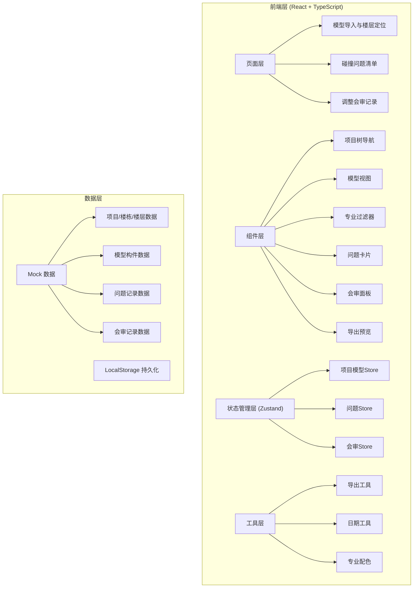
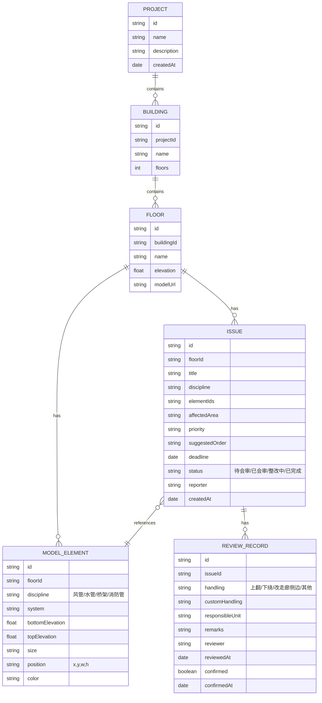

## 1. 架构设计



## 2. 技术描述

- **前端框架**: React@18 + TypeScript + Vite@6
- **状态管理**: Zustand@4
- **路由管理**: react-router-dom@6
- **样式方案**: Tailwind CSS@3
- **图标库**: lucide-react
- **导出功能**: xlsx (Excel导出) + jspdf (PDF导出)
- **后端**: 纯前端应用，使用 Mock 数据 + LocalStorage 持久化
- **数据存储**: LocalStorage 存储用户数据，内置 Mock 数据用于演示

## 3. 路由定义

| 路由 | 用途 |
|-------|---------|
| `/` | 重定向到模型导入页面 |
| `/model` | 模型导入与楼层定位页面 |
| `/issues` | 碰撞问题清单页面 |
| `/review` | 调整会审记录页面 |

## 4. 数据模型

### 4.1 数据模型定义



### 4.2 TypeScript 类型定义

```typescript
// 专业类型
type Discipline = 'airduct' | 'waterpipe' | 'cabletray' | 'firepipe';

// 问题状态
type IssueStatus = 'pending' | 'reviewed' | 'fixing' | 'completed';

// 处理方式
type HandlingType = 'lift_up' | 'go_under' | 'side_corridor' | 'custom';

// 项目
interface Project {
  id: string;
  name: string;
  description: string;
  createdAt: string;
}

// 楼栋
interface Building {
  id: string;
  projectId: string;
  name: string;
  floors: number;
}

// 楼层
interface Floor {
  id: string;
  buildingId: string;
  name: string;
  elevation: number;
  modelUrl?: string;
}

// 模型构件
interface ModelElement {
  id: string;
  floorId: string;
  discipline: Discipline;
  system: string;
  bottomElevation: number;
  topElevation: number;
  size: string;
  position: { x: number; y: number; width: number; height: number };
  color: string;
}

// 问题
interface Issue {
  id: string;
  floorId: string;
  title: string;
  discipline: Discipline;
  elementIds: string[];
  affectedArea: string;
  priority: 'high' | 'medium' | 'low';
  suggestedOrder: string;
  deadline: string;
  status: IssueStatus;
  reporter: string;
  createdAt: string;
  photos?: string[];
}

// 会审记录
interface ReviewRecord {
  id: string;
  issueId: string;
  handling: HandlingType;
  customHandling?: string;
  responsibleUnit: string;
  remarks: string;
  reviewer: string;
  reviewedAt: string;
  confirmed: boolean;
  confirmedAt?: string;
}
```

## 5. 项目结构

```
src/
├── components/          # 可复用组件
│   ├── layout/         # 布局组件
│   │   ├── Sidebar.tsx
│   │   ├── Header.tsx
│   │   └── PageLayout.tsx
│   ├── ProjectTree.tsx  # 项目树导航
│   ├── ModelCanvas.tsx  # 模型视图画布
│   ├── DisciplineFilter.tsx  # 专业过滤器
│   ├── IssueCard.tsx    # 问题卡片
│   ├── IssueForm.tsx    # 问题表单
│   ├── ReviewPanel.tsx  # 会审面板
│   └── ExportPreview.tsx  # 导出预览
├── pages/               # 页面组件
│   ├── ModelPage.tsx
│   ├── IssuesPage.tsx
│   └── ReviewPage.tsx
├── store/               # Zustand 状态管理
│   ├── projectStore.ts
│   ├── issueStore.ts
│   └── reviewStore.ts
├── types/               # TypeScript 类型定义
│   └── index.ts
├── utils/               # 工具函数
│   ├── export.ts
│   ├── disciplineColors.ts
│   └── date.ts
├── data/                # Mock 数据
│   ├── mockProjects.ts
│   ├── mockElements.ts
│   ├── mockIssues.ts
│   └── mockReviews.ts
├── App.tsx
├── main.tsx
└── index.css
```
